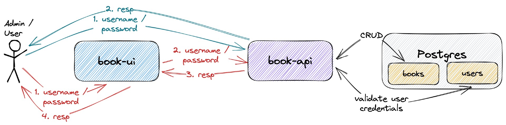
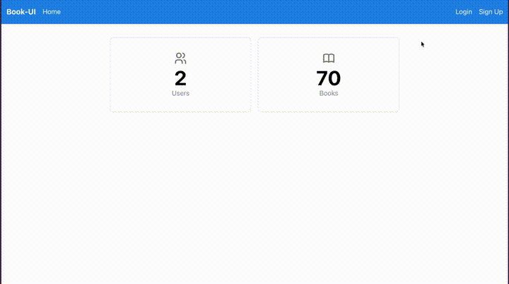
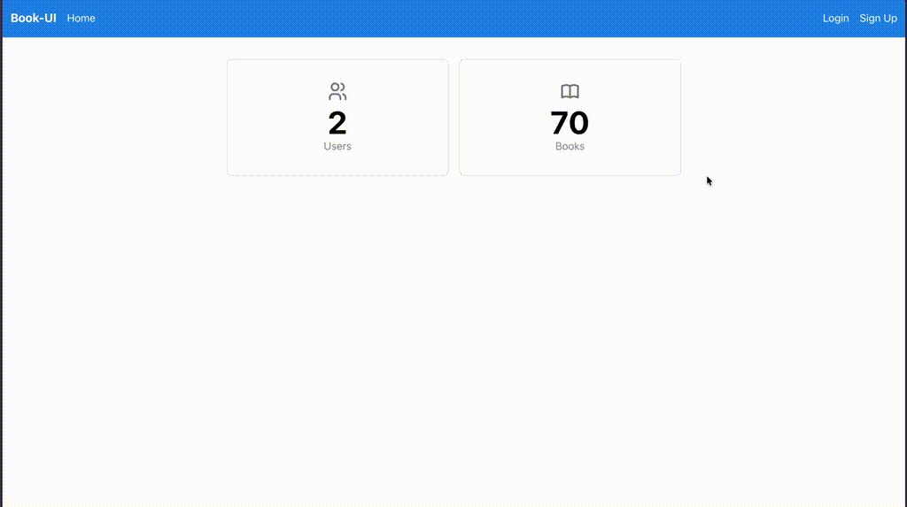

# springboot-react-basic-auth

The goal of this project is to implement an application called `book-app` to manage books. For it, we will implement a back-end [`Spring Boot`](https://docs.spring.io/spring-boot/docs/current/reference/htmlsingle/) application called `book-api` and a font-end [React](https://react.dev/) application called `book-ui`. Besides, we will use [`Basic Authentication`](https://en.wikipedia.org/wiki/Basic_access_authentication) to secure both applications.

## Proof-of-Concepts & Articles

On [ivangfr.github.io](https://ivangfr.github.io), I have compiled my Proof-of-Concepts (PoCs) and articles. You can easily search for the technology you are interested in by using the filter. Who knows, perhaps I have already implemented a PoC or written an article about what you are looking for.

## Additional Readings

- \[**Medium**\] [**Implementing A Full Stack Web App Using Spring-Boot and React**](https://medium.com/javarevisited/implementing-a-full-stack-web-app-using-spring-boot-and-react-7db598df4452)
- \[**Medium**\] [**Implementing Social Login in a Spring Boot and React App**](https://medium.com/@ivangfr/implementing-social-login-in-a-spring-boot-and-react-app-6ce073c9983c)
- \[**Medium**\] [**Building a Web Chat with Social Login using Spring Boot: Introduction**](https://medium.com/@ivangfr/building-a-web-chat-with-social-login-using-spring-boot-introduction-644702e6be8e)
- \[**Medium**\] [**Building a Single Spring Boot App with Keycloak or Okta as IdP: Introduction**](https://medium.com/@ivangfr/building-a-single-spring-boot-app-with-keycloak-or-okta-as-idp-introduction-2814a4829aed)

## Project Diagram



## Applications

- ### book-api

  `Spring Boot` Web Java backend application that exposes a Rest API to create, retrieve and delete books. If a user has `ADMIN` role he/she can also retrieve information of other users or delete them.
  
  The application secured endpoints can just be just accessed if a user has valid credentials (`username` and `password`) and has autorization roles for it.
  
  `book-api` stores its data in [`Postgres`](https://www.postgresql.org/) database.

  `book-api` has the following endpoints

  | Endpoint                                                      | Secured | Roles           |
  | ------------------------------------------------------------- | ------- | --------------- |
  | `POST /auth/authenticate -d {"username","password"}`          | No      |                 |
  | `POST /auth/signup -d {"username","password","name","email"}` | No      |                 |
  | `GET /public/numberOfUsers`                                   | No      |                 |
  | `GET /public/numberOfBooks`                                   | No      |                 |
  | `GET /api/users/me`                                           | Yes     | `ADMIN`, `USER` |
  | `GET /api/users`                                              | Yes     | `ADMIN`         |
  | `GET /api/users/{username}`                                   | Yes     | `ADMIN`         |
  | `DELETE /api/users/{username}`                                | Yes     | `ADMIN`         |
  | `GET /api/books [?text]`                                      | Yes     | `ADMIN`, `USER` |
  | `POST /api/books -d {"isbn","title"}`                         | Yes     | `ADMIN`         |
  | `DELETE /api/books/{isbn}`                                    | Yes     | `ADMIN`         |

- ### book-ui

  `React` frontend application where a user with role `USER` can retrieve the information of a specific book or a list of books. On the other hand, a user with role `ADMIN` has access to all secured endpoints.
  
  To login, a `user` or `admin` must provide valid `username` and `password` credentials. `book-ui` communicates with `book-api` to get `books` and `users` data.
  
  `book-ui` uses [`Semantic UI React`](https://react.semantic-ui.com/) as CSS-styled framework.

## Prerequisites

- [`npm`](https://docs.npmjs.com/downloading-and-installing-node-js-and-npm)
- [`Java 17+`](https://www.oracle.com/java/technologies/downloads/#java17)
- [`Docker`](https://www.docker.com/)

## Start Environment

- In a terminal, make sure you are inside `springboot-react-basic-auth` root folder

- Run the following command to start docker compose containers
  ```
  docker compose up -d
  ```

## Running book-app using Maven & Npm

- **book-api**

  - Open a terminal and navigate to `springboot-react-basic-auth/book-api` folder

  - Run the following `Maven` command to start the application
    ```
    ./mvnw clean spring-boot:run
    ```

- **book-ui**

  - Open another terminal and navigate to `springboot-react-basic-auth/book-ui` folder

  - Run the command below if you are running the application for the first time
    ```
    npm install
    ```

  - Run the `npm` command below to start the application
    ```
    npm start
    ```

## Applications URLs

| Application | URL                                   | Credentials                                         |
| ----------- | ------------------------------------- | --------------------------------------------------- |
| book-api    | http://localhost:8080/swagger-ui.html |                                                     |
| book-ui     | http://localhost:3000                 | `admin/admin`, `user/user` or signing up a new user |

> **Note**: the credentials shown in the table are the ones already pre-defined. You can signup new users.

## Demo

- The gif below shows a `user` loging in

  

- The gif below shows an `admin` loging in

  

## Testing book-api Endpoints

- **Manual Endpoints Test using Swagger**

  - Open a browser and access http://localhost:8080/swagger-ui.html. All endpoints with the lock sign are secured. In order to access them, you need a valid `username` and `password` credentials.

  - Click `Authorize` button (white/green one, almost at the top of the page, right side)

  - In the `Basic authentication` form that will open, provide the `admin` credentials (`admin/admin`) or `user` ones (`user/user`). Then, click `Authorize` and, finally, click `Close` button.

  - Make some call to the endpoints

- **Manual Endpoints Test using curl**

  - Open a terminal

  - Call `GET /public/numberOfBooks`
    ```
    curl -i localhost:8080/public/numberOfBooks
    ```
    It should return
    ```
    HTTP/1.1 200
    70
    ```
    
  - Call `GET /api/books` without credentials
    ```
    curl -i localhost:8080/api/books
    ```
    As this endpoint requires authentication, it should return
    ```
    HTTP/1.1 401
    { "timestamp": "...", "status": 401, "error": "Unauthorized", "message": "Unauthorized", "path": "/api/books" }
    ```
    
  - Call again `GET /api/books` but now with `user` credentials
    ```
    curl -i -u user:user localhost:8080/api/books
    ```
    It should return
    ```
    HTTP/1.1 200
    [
      {"isbn":"978-1-60309-445-0","title":"A Shining Beacon"},
      {"isbn":"978-1-891830-85-3","title":"American Elf (Book 2)"},
      ...
    ]
    ```
    
  - Call `POST /api/books` with `user` credentials
    ```
    curl -i -u user:user -X POST localhost:8080/api/books \
    -H "Content-Type: application/json" -d '{"isbn": "9781617292545", "title": "Spring Boot in Action"}'
    ```
    As `user` doesn't have the role `ADMIN`, it should return
    ```
    HTTP/1.1 403
    { "timestamp": "...", "status": 403, "error": "Forbidden", "message": "Forbidden", "path": "/api/books" }
    ```
    
  - Call `POST /api/books` with `admin` credentials
    ```
    curl -i -u admin:admin -X POST localhost:8080/api/books \
    -H "Content-Type: application/json" -d '{"isbn": "9781617292545", "title": "Spring Boot in Action"}'
    ```
    It should return
    ```
    HTTP/1.1 201
    { "isbn":"9781617292545","title":"Spring Boot in Action" }
    ```

- **Automatic Endpoints Test**

  - Open a terminal and make sure you are in `springboot-react-basic-auth` root folder
  
  - Run the following script
    ```
    ./book-api/test-endpoints.sh
    ```
    It should return something like the output below, where it shows the http code for different requests 
    ```
    POST auth/authenticate
    ======================
    admin Auth Resp: {"id":1,"name":"Admin","role":"ADMIN"}
    
    POST auth/authenticate
    ======================
    user Auth Resp: {"id":2,"name":"User","role":"USER"}
    
    POST auth/signup
    ================
    user2 Auth Resp: {"id":3,"name":"User2","role":"USER"}
    
    Authorization
    =============
                    Endpoints | without creds |  user creds |  admin creds |
    ------------------------- + ------------- + ----------- + ------------ |
     GET public/numberOfUsers |           200 |         200 |          200 |
     GET public/numberOfBooks |           200 |         200 |          200 |
    ......................... + ............. + ........... + ............ |
            GET /api/users/me |           401 |         200 |          200 |
               GET /api/users |           401 |         403 |          200 |
         GET /api/users/user2 |           401 |         403 |          200 |
      DELETE /api/users/user2 |           401 |         403 |          200 |
    ......................... + ............. + ........... + ............ |
               GET /api/books |           401 |         200 |          200 |
              POST /api/books |           401 |         403 |          201 |
        DELETE /api/books/abc |           401 |         403 |          200 |
    ------------------------------------------------------------------------
     [200] Success -  [201] Created -  [401] Unauthorized -  [403] Forbidden
    ```

## Util Commands

- **Postgres**
  ```
  docker exec -it postgres psql -U postgres -d bookdb
  \dt
  ```

## Shutdown

- To stop `book-api` and `book-ui`, go to the terminals where they are running and press `Ctrl+C`

- To stop and remove docker compose containers, network and volumes, go to a terminal and, inside `springboot-react-basic-auth` root folder, run the command below
  ```
  docker compose down -v
  ```

## How to upgrade book-ui dependencies to latest version

- In a terminal, make sure you are in `springboot-react-basic-auth/book-ui` folder

- Run the following commands
  ```
  npm upgrade
  npm i -g npm-check-updates
  ncu -u
  npm install
  ```

## References

- https://www.taniarascia.com/using-context-api-in-react/
- https://medium.com/better-programming/building-basic-react-authentication-e20a574d5e71
- https://jasonwatmore.com/post/2018/09/11/react-basic-http-authentication-tutorial-example
